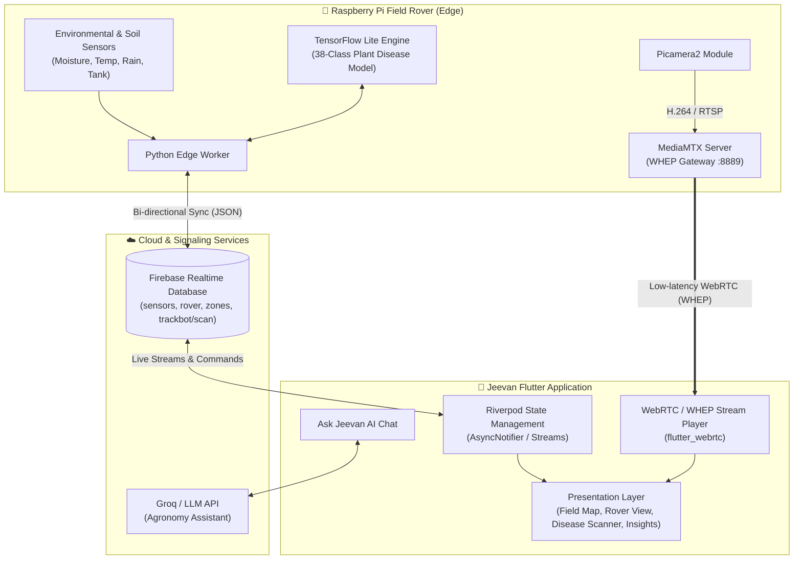
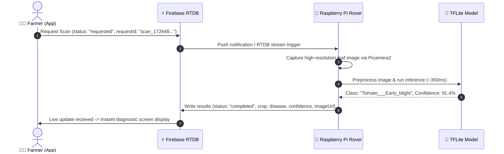

<div align="center">

# जीवन · Jeevan
### *Smart Crop Health Monitoring Rover*

[](https://flutter.dev)
[](https://dart.dev)
[](https://www.raspberrypi.com/)
[](https://www.python.org/)
[](https://www.tensorflow.org/lite)
[](https://webrtc.org/)
[](https://firebase.google.com/)

<p align="center">
  <strong>An intelligent precision-agriculture rover system paired with a high-performance Flutter mobile application for remote field monitoring, sub-second live video telemetry, and real-time edge AI plant disease diagnostics.</strong>
</p>

---

</div>

## 📖 Overview

**Jeevan (जीवन)** is an end-to-end smart agricultural robotics and crop health monitoring system designed to bridge the gap between complex IoT sensor telemetry and actionable, on-the-ground farming decisions.

Operating directly in the field, an autonomous or remotely-operated **Raspberry Pi-powered rover** captures zone-by-zone environmental metrics, streams sub-second live video over **WebRTC (WHEP)**, and executes on-device **TensorFlow Lite edge AI** to diagnose plant diseases across 38 distinct classes. Farmers and agronomists interact with the rover through an intuitive, cross-platform **Flutter mobile application** backed by an event-driven **Firebase Realtime Database** synchronization engine and an intelligent LLM agronomy assistant.

---

## 🌟 Key Highlights

- 📱 **Intelligent Mobile Application**: Modern, responsive Flutter application (Android, iOS, tablet) providing real-time rover telemetry, zone-by-zone soil moisture heatmaps, mission progress tracking, and AI-powered crop health analysis.
- ⚡ **Event-Driven Firebase Architecture**: Bi-directional, real-time synchronization between the mobile client and the field rover via Firebase Realtime Database (`trackbot/scan`), enabling remote scan triggers, live status updates, and instantaneous diagnostic reporting.
- 📹 **Ultra-Low Latency Video Streaming**: Sub-second WebRTC/WHEP live camera feed powered by a hardware-accelerated **Picamera2**, H.264/RTSP encoding pipeline, and a **MediaMTX** streaming gateway integrated seamlessly into Flutter via `flutter_webrtc`.
- 🧠 **Edge-AI Crop Disease Classification**: On-device 38-class plant pathology neural network running locally on the Raspberry Pi with **TensorFlow Lite**, delivering millisecond-grade inference without cloud dependencies or field connectivity bottlenecks.
- 💧 **Precision Irrigation & Field Diagnostics**: Zone-based moisture analytics, environmental sensor monitoring (soil/air temperature, humidity, rain detection, water tank levels), and automated irrigation recommendations.
- 🤖 **"Ask Jeevan" AI Agronomy Assistant**: Integrated LLM chat assistant providing context-aware agricultural insights, diagnostic explanations, and tailored crop management advice.

---

## 🏗️ System Architecture

The Jeevan ecosystem connects physical field robotics with cloud synchronization and mobile client interfaces:



---

## 🔬 Edge AI Plant Disease Pipeline

The crop health diagnostic pipeline runs directly on the Raspberry Pi, eliminating the latency and bandwidth cost of uploading raw video/images to cloud servers.

### 1. The 38-Class Plant Disease Classifier
The on-device TensorFlow Lite model classifies healthy leaves and common agricultural pathologies across major crops:
- **Tomato**: Bacterial Spot, Early Blight, Late Blight, Leaf Mold, Septoria Leaf Spot, Spider Mites, Target Spot, Yellow Leaf Curl Virus, Mosaic Virus, Healthy
- **Potato**: Early Blight, Late Blight, Healthy
- **Corn (Maize)**: Cercospora Leaf Spot (Gray Leaf Spot), Common Rust, Northern Leaf Blight, Healthy
- **Apple**: Apple Scab, Black Rot, Cedar Apple Rust, Healthy
- **Grape**: Black Rot, Esca (Black Measles), Leaf Blight (Isariopsis), Healthy
- **Bell Pepper**: Bacterial Spot, Healthy
- **Strawberry, Peach, Cherry, Squash, Blueberry, Raspberry, Soybean**: Leaf Scorch, Powdery Mildew, Bacterial diseases, and Healthy states.

### 2. Event-Driven Scan Lifecycle


---

## 📹 Low-Latency WebRTC / WHEP Video Pipeline

To ensure responsive rover teleoperation and real-time visual inspection, Jeevan avoids traditional high-latency HLS/DASH protocols in favor of **WebRTC over WHEP (WebRTC HTTP Egress Protocol)**:

```
[Picamera2] ──► [H.264 Encoder] ──► [RTSP :8554] ──► [MediaMTX WebRTC Server] ──► [WHEP :8889] ──► [Flutter WebRTC]
```

- **Capture & Encoding**: Hardware H.264 encoding via `libcamera`/`Picamera2` on the Raspberry Pi.
- **RTSP Ingestion**: Local RTSP feed published to `MediaMTX` on `rtsp://localhost:8554/cam`.
- **WHEP Distribution**: MediaMTX provides a lightweight WHEP endpoint at `http://<RPI_IP>:8889/cam/whep`.
- **Client Playback**: `flutter_webrtc` establishes an SDP handshake via standard HTTP POST to the WHEP endpoint, delivering sub-200ms glass-to-glass video latency.

---

## 📱 Mobile Application Features

| Feature | Description |
| :--- | :--- |
| **🏠 Home Dashboard** | Glanceable overview of farm health, priority action alerts (irrigation, crop alerts, battery), weather outlook, and live rover status. |
| **🗺️ 2D Interactive Field Map** | Custom Canvas vector map showing irregular field boundaries, zone polygons, moisture heatmaps, rover scan paths, and sensor points. |
| **🔍 Zone Diagnostics** | Detailed breakdown of moisture, soil/air temperature, humidity, pH, EC, water tank levels, and calculated water volume requirements. |
| **🤖 Live Rover Command Center** | Real-time WebRTC camera feed, mission timeline, battery/signal gauges, and mission control buttons (Start, Pause, Return to Base). |
| **🌿 Crop Health Scanner** | Trigger on-demand rover scans or upload local photos to view disease diagnosis, confidence metrics, and targeted treatment recommendations. |
| **💧 Smart Irrigation Manager** | Zone-by-zone water scheduling, pump simulation, historical water consumption trends, and rain-delay intelligence. |
| **💬 Ask Jeevan (AI Agronomist)** | Conversational assistant powered by LLMs (Groq / Llama) capable of answering complex farming queries with structured field data. |

---

## 🛠️ Tech Stack & Technologies

### Mobile & Frontend
- **Framework**: [Flutter](https://flutter.dev) (Dart, null-safe)
- **State Management**: [Riverpod 2.x](https://riverpod.dev) (`AsyncNotifier`, `StreamProvider`)
- **Navigation & Routing**: [GoRouter](https://pub.dev/packages/go_router) with `StatefulShellRoute`
- **Charts & Telemetry UI**: [fl_chart](https://pub.dev/packages/fl_chart)
- **Video & Real-Time Communication**: [flutter_webrtc](https://pub.dev/packages/flutter_webrtc)
- **Network & Connectivity**: `connectivity_plus`, `http`, `flutter_dotenv`

### Embedded Robotics & Edge AI
- **Hardware Platform**: Raspberry Pi 4B / 5 with Raspberry Pi Camera Module 3
- **Language & Runtime**: Python 3.10+
- **Machine Learning**: TensorFlow Lite Runtime (`tflite_runtime`)
- **Camera Pipeline**: `Picamera2`, OpenCV, GStreamer / FFmpeg
- **Media Server**: [MediaMTX](https://github.com/bluenviron/mediamtx) (RTSP / WebRTC / WHEP)

### Cloud & Backend
- **Database**: Firebase Realtime Database (event-driven telemetry & control)
- **Cloud Storage**: Firebase Storage (crop scan imagery)
- **AI / LLM Gateway**: Groq API (`openai/gpt-oss-120b` or `llama3-70b-8192`)

---

## 📂 Project Structure

```
jeevan/
├── lib/
│   ├── main.dart                          # App entry point & initialization
│   ├── app.dart                           # MaterialApp.router, theme & DI configuration
│   │
│   ├── core/                              # Core design system, constants & utilities
│   │   ├── constants/                     # Mock latency & stream configs (StreamConfig)
│   │   ├── routing/                       # GoRouter configuration & route paths
│   │   ├── theme/                         # Colors, typography, spacing, radius & theme
│   │   └── utils/                         # Breakpoints, formatters & Result helpers
│   │
│   ├── domain/                            # Enterprise domain layer (Pure Dart)
│   │   ├── models/                        # Immutable data models (Farm, Zone, CropScan, Rover)
│   │   └── repositories/                  # Abstract repository contracts
│   │
│   ├── data/                              # Data layer & implementations
│   │   ├── firebase/                      # Firebase Realtime Database repositories
│   │   ├── groq/                          # Groq LLM API client for Jeevan Assistant
│   │   └── mock/                          # Seed data & simulated fallback repositories
│   │
│   ├── application/                       # Riverpod providers & business controllers
│   │   ├── crop_health/                   # Crop scanning & disease classification state
│   │   ├── rover/                         # Rover telemetry & WebRTC stream controllers
│   │   ├── field/                         # Field map & zone state providers
│   │   ├── home/                          # Dashboard summary & alert providers
│   │   └── chat/                          # AI Assistant chat providers
│   │
│   ├── features/                          # Screen presentations
│   │   ├── home/                          # Home dashboard
│   │   ├── field/                         # 2D Interactive map & Zone details
│   │   ├── rover/                         # Rover overview, live feed & mission tracking
│   │   ├── crop_health/                   # Crop analysis & scan results
│   │   ├── irrigation/                    # Irrigation control & water analytics
│   │   ├── insights/                      # Historical trends & recommendations
│   │   ├── assistant/                     # Jeevan AI chat screen
│   │   └── splash/                        # Branded launch screen
│   │
│   └── widgets/                           # Reusable UI component library
│       ├── alerts/                        # Severity alert banners
│       ├── app_bar/                       # Branded application bars
│       ├── crop/                          # Crop health cards & scan widgets
│       ├── field/                         # Custom canvas map painters & legends
│       ├── skeleton/                      # Zero-spinner layout-matching loaders
│       └── status/                        # Accessible status badges
│
├── assets/                                # Custom icons, illustrations & mock imagery
├── firebase_seed_data.json                # Canonical test data for Firebase RTDB
└── pubspec.yaml                           # Project dependencies and asset manifests
```

---

## ⚡ Firebase Realtime Database Schema

```json
{
  "rover": {
    "id": "R-01",
    "status": "scanning",
    "currentZone": "zone-b",
    "connection": "strong",
    "battery": 82
  },
  "sensors": {
    "soilMoisture": 42,
    "temperature": 28.4,
    "humidity": 54,
    "rainIntensity": 0,
    "rainStatus": false
  },
  "tanks": {
    "pesticideLevel": 74
  },
  "trackbot": {
    "scan": {
      "requestId": "scan_1726480000000",
      "status": "completed",
      "requestedAt": 1726480000000,
      "completedAt": 1726480001250,
      "crop": "Tomato",
      "disease": "Early Blight",
      "confidence": 0.914,
      "inferenceMs": 350.0,
      "imageUrl": "https://storage.googleapis.com/.../leaf_01.jpg"
    }
  }
}
```

---

## 🚀 Getting Started

### Prerequisites
- **Flutter SDK**: `^3.11.0` or later
- **Dart SDK**: `^3.11.0` or later
- **Raspberry Pi**: Pi 4B/5 running Raspberry Pi OS (64-bit) with Camera Module
- **Firebase Project**: With Realtime Database enabled

---

### 1. Mobile App Setup

1. **Clone the repository:**
   ```bash
   git clone https://github.com/your-username/jeevan.git
   cd jeevan
   ```

2. **Install Flutter dependencies:**
   ```bash
   flutter pub get
   ```

3. **Configure Environment Variables:**
   Create a `.env` file in the root directory (based on `.env.example`):
   ```env
   GROQ_API_KEY=your_groq_api_key_here
   GROQ_MODEL=openai/gpt-oss-120b
   ```

4. **Configure Rover WebRTC Stream URL:**
   Update the Raspberry Pi IP address in [`lib/core/constants/stream_config.dart`](file:///home/utssav/jeevan/lib/core/constants/stream_config.dart):
   ```dart
   static const String roverCameraStreamUrl = 'http://<YOUR_RPI_IP>:8889/cam/whep';
   ```

5. **Run the Application:**
   ```bash
   flutter run
   ```

---

### 2. Raspberry Pi & MediaMTX Setup

1. **Install MediaMTX:**
   Download and install the latest ARM64 binary of [MediaMTX](https://github.com/bluenviron/mediamtx/releases).

2. **Configure MediaMTX (`mediamtx.yml`):**
   ```yaml
   paths:
     cam:
       runOnInit: rpicam-vid -t 0 --camera 0 --width 1280 --height 720 --framerate 30 --codec h264 --inline --listen -o rtsp://127.0.0.1:8554/cam
       runOnInitRestart: yes
   ```

3. **Run MediaMTX:**
   ```bash
   ./mediamtx
   ```
   *WebRTC stream is immediately accessible at `http://<RPI_IP>:8889/cam/whep`.*

---

### 3. Edge AI Worker Setup (Raspberry Pi)

1. **Install dependencies:**
   ```bash
   pip install tflite-runtime opencv-python firebase-admin
   ```

2. **Run the edge listener:**
   The Python worker listens to `trackbot/scan` in Firebase RTDB, executes image capture and TFLite inference upon request, and writes back the classification result and confidence score.

---

## 🎨 Design System & UI Philosophy

- **Clarity Over Decoration**: Designed for working farmers in bright sunlight; clean typography, high-contrast indicators, and zero unnecessary visual clutter.
- **Explainable Diagnostics**: Every sensor metric and AI prediction is paired with human-readable context and confidence scores (e.g., *"Very Low — 22%"* or *"Likely Early Blight (91.4% Confidence)"*).
- **Layout-Matching Skeleton Loading**: Eliminates abrupt layout shifts and generic spinners using bespoke skeleton placeholders that mirror final screen components.
- **Universal Accessibility**: Large touch targets (≥48×48dp), WCAG AA outdoor-rated contrast, and semantic labels across all status badges and interactive controls.

---

## 📄 License

This project is licensed under the **MIT License** — see the [LICENSE](LICENSE) file for details.

---

<div align="center">
  <sub>Developed with ❤️ for the future of sustainable, precision agriculture.</sub>
</div>
